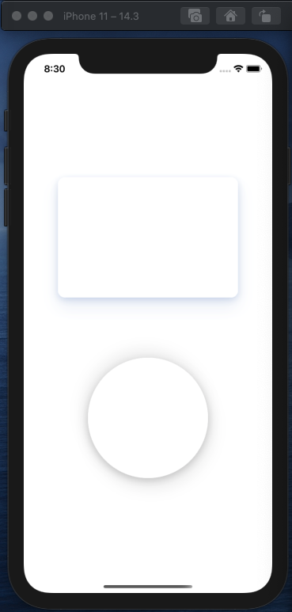

# `rn-shadows`

Multi layer shadow component for react native



## Installation

Install the library using either Yarn:

```sh
yarn add rn-shadows
```

or npm:

```sh
npm install rn-shadows
```

## Usage

```js
import Shadow from "rn-shadows";

// ...

<Shadow
 elevation={6}
 borderRadius={12}
 shadows={[
  [-5, 16, 14, '#17479E', 0.02],
  [5, 16, 14, '#17479E', 0.02],
  [-2, 4, 6, '#17479E', 0.03],
  [2, 4, 6, '#17479E', 0.03],
 ]}
>
 <View style={{ padding: 50 }}>
    <Text>Shadow</Text>
 </View>
</Shadow>
```

## License

MIT
